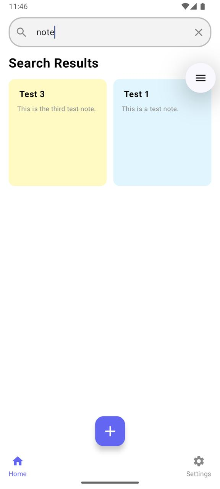

# SimpleNote — Android Notes App

[](LICENSE)
[]()

**A clean, lightweight Android client for the SimpleNote backend** — focused on fast note-taking, simple UX, and easy integration with a REST API (pagination, search, authentication with refresh tokens supported).

---

## Table of Contents

* [Features](#features)
* [Screenshots](#screenshots)
* [Tech & Architecture](#tech--architecture)
* [Requirements](#requirements)
* [Getting Started](#getting-started)

  * [Clone](#clone)
  * [Open in Android Studio](#open-in-android-studio)
  * [Build from command line](#build-from-command-line)
  * [Run on Emulator / Device](#run-on-emulator--device)
* [Configuration (API)](#configuration-api)
* [API & Postman](#api--postman)
* [Screenshots & README gallery](#screenshots--readme-gallery)
* [Contributing](#contributing)
* [Roadmap](#roadmap)
* [Troubleshooting](#troubleshooting)
* [License](#license)

---

## Features

* User registration and login (JWT + refresh token handling)
* Notes list (server-side pagination)
* Search notes
* View note details
* Create, edit and delete notes
* Profile screen and logout
* Straightforward architecture for easy extension

---

## Screenshots

**Gallery**

<div align="center">
  <table>
    <tr>
      <td></td>
      <td></td>
      <td></td>
    </tr>
    <tr>
      <td align="center">Start page</td>
      <td align="center">Register page</td>
      <td align="center">Login page</td>
    </tr>
  </table>
</div>

<div align="center">
  <table>
    <tr>
      <td></td>
      <td></td>
      <td></td>
    </tr>
    <tr>
      <td align="center">Home page</td>
      <td align="center">Search bar</td>
      <td align="center">Note</td>
    </tr>
  </table>
</div>

<div align="center">
  <table>
    <tr>
      <td></td>
      <td></td>
    </tr>
    <tr>
      <td align="center">Change password page</td>
      <td align="center">Profile page</td>
    </tr>
  </table>
</div>


---

## Tech & Architecture

* Language: Kotlin
* UI: Jetpack Compose or XML (check `app/src/main/res/layout` or `compose` modules for specifics)
* Architecture: MVVM with ViewModel + LiveData / Kotlin Flow
* Networking: Retrofit + OkHttp (or similar) with token refresh interceptor
* Image loading: Coil / Glide
* Dependency Injection: Hilt / Koin
* Local storage: Room (optional)

---

## Requirements

* Android Studio (recommend latest stable; tested with Arctic Fox / Chipmunk or later)
* JDK 11+ (as required by Gradle plugin in project)
* Android SDK (match `compileSdkVersion` in `build.gradle`)

---

## Getting Started

### Clone

```bash
git clone https://github.com/kasrahmi/Notable-andriod.git
cd Notable-andriod
```

### Open in Android Studio

1. Open Android Studio.
2. Choose **Open** and pick the project folder (`Notable-andriod`).
3. Let Android Studio sync Gradle and download dependencies.

### Build from command line

```bash
# Linux / macOS
./gradlew assembleDebug

# Windows
gradlew.bat assembleDebug
```

### Run on Emulator / Device

* From Android Studio: select a device or emulator and press the Run ▶ button.
* From command line (install debug APK to a connected device/emulator):

```bash
./gradlew installDebug
adb shell am start -n "com.your.package.name/.MainActivity"
```

Replace `com.your.package.name` with your app's applicationId (check `app/build.gradle`).

---

## Configuration (API)

The app uses a base API URL that you can update in configuration. Common places to look:

* `app/src/main/java/.../BuildConfig` or `Constants.kt`
* `gradle.properties` or `local.properties` (if the project uses build-time config)

Typical values:

* `API_BASE_URL=https://simple-note.amirsalarsafaei.com`

If you need to run against a local backend, set the base URL to your machine IP (e.g. `http://192.168.1.5:8000`) and ensure the emulator/device can reach it.

---

## API & Postman

The backend documentation (OpenAPI/Redoc) and Postman collection are available at:

`https://simple-note.amirsalarsafaei.com/api/schema/redoc/`

Example `curl` usage:

**Login**

```bash
curl -X POST "https://simple-note.amirsalarsafaei.com/api/auth/login/" \
  -H 'Content-Type: application/json' \
  -d '{"username":"you@example.com","password":"password"}'
```

**Get notes (paginated)**

```bash
curl -H "Authorization: Bearer <access_token>" \
  "https://simple-note.amirsalarsafaei.com/api/notes/?page=1&page_size=20"
```

---

## Contributing

Thanks for considering contributing! Please:

1. Fork the repo
2. Create a feature branch: `git checkout -b feat/awesome-feature`
3. Commit your changes with clear messages
4. Open a Pull Request describing what changed and why

---

## Roadmap

Planned improvements:

* Image attachments in notes
* Rich text support
* Improved UI polish and animations

---

## Troubleshooting

**Gradle sync fails**

* Run `./gradlew --refresh-dependencies` and re-sync in Android Studio.

**App crashes with network errors**

* Verify `API_BASE_URL` setting and internet permission in `AndroidManifest.xml` (`<uses-permission android:name="android.permission.INTERNET"/>`).

---

## License

This project is released under the MIT License. See [LICENSE](LICENSE) for details.

